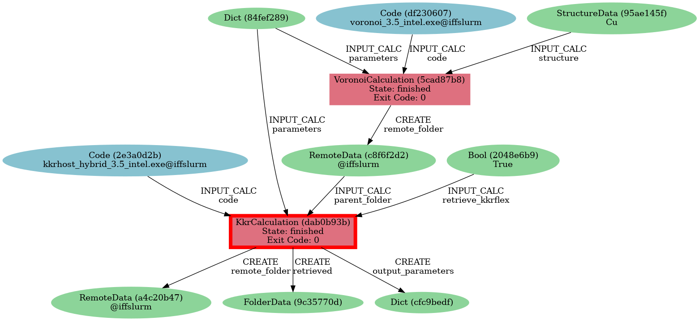
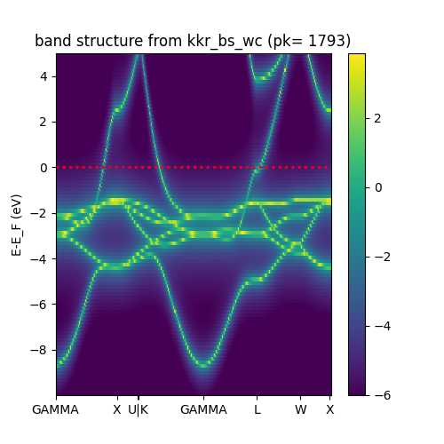
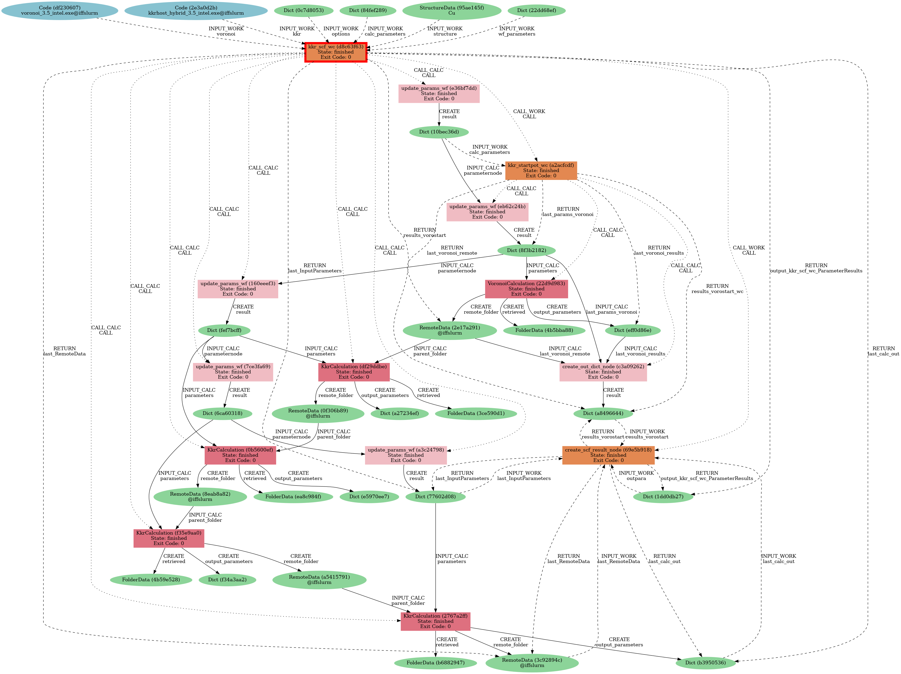
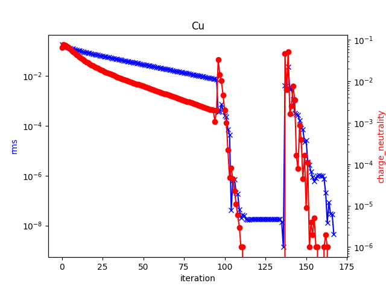

*If you are new to python and/or AiiDA you may want to look at the [python crash course notebook](../aiida-fleur/0_Python_crash-course_optional_.ipynb) and the [introduction to AiiDA notebook](../aiida-fleur/1_AiiDA_data_types_and_verdi_commands.ipynb) before starting this tutorial.*

# **AiiDA-KKR command-line interface**


The AiiDA-KKR plugin comes with a command-line interface that exposes some of its functionalities.

So far the following commands are available:
* `aiida-kkr data parameter import` - tool to import calculation parameters from an `inputcard`
* `aiida-kkr data structure import` - tool to import structure (and calculation parameters from an `inputcard`)
* `aiida-kkr launch voro` - interface to voronoi calculation
* `aiida-kkr launch kkr` - interface to KKRhost calculation
* `aiida-kkr launch scf` - interface to KKRhost self-consistency workflow
* `aiida-kkr launch dos` - interface to DOS workflow
* `aiida-kkr launch bs` - interface to bandstructure workflow
* `aiida-kkr launch kkrimpscf` - interface to `kkr_imp_wc` impurity embedding workflow
* `aiida-kkr plot` - interface to `plot_kkr` tool
> __Note:__\
> use the `-h` argument to show help for these commands and command groups.

In the following, we will go through some of the CLI tools to demonstrate the usage. In this example, we will import data from a sample `inputcard` and run a full SCF calculation with the KKRhost code through aiida.

To follow these instructions open a terminal and go to the `CLI_tutorial` sub-directory of the AiiDA-KKR tutorial.

## **Importing data**

We start by importing the setup of a possible calculation. We will use the `aiida-kkr data structure import` tool to convert this inputcard:
```
# this is an example file of an inputcard that is used to read in the structure and parameters from a file

NSPIN= 1
LMAX= 2

ALATBASIS= 6.822  # in a_Bohr

BRAVAIS
0.0 0.5 0.5
0.5 0.0 0.5
0.5 0.5 0.0

NAEZ= 1

<RBASIS>      <ZATOM>
0.0 0.0 0.0     29

RCLUSTZ= 2.3

EMIN    EMAX    TEMPR  NPOL  NPT1  NPT2  NPT3
-0.4    1.0     500.0   6     4     18    4


RMAX=  7
GMAX= 65
```
into AiiDA nodes (namely `StructureData` and `Dict` nodes):

```shell
$ aiida-kkr data structure import inputcard.txt --kkrpara 
Success: stored kkr params Dict node <1781>
Success: parsed and stored StructureData <1782> with formula Cu
```

We are going to reuse the structure and parameter nodes we imported. Thus we save them as environment variables:

```shell
$ export PK_PARA=1781
$ export PK_STRUC=1782
```
---

## **Running calculations**

We will use our imported data to run a simple calculation where we first run voronoi and then a KKRhost calculation. In these examples we will use the following codes:
```shell
$ verdi code list
# List of configured codes:
# (use 'verdi code show CODEID' to see the details)
* pk 691 - voronoi_3.5_intel@iffslurm
* pk 693 - kkrhost_3.5_intel@iffslurm
```


### Voronoi calculation

We start by running the voronoi calulation (see `aiida-kkr voro launch -h` for a description of the inputs):
```shell
$ aiida-kkr launch voro \
  -s $PK_STRUC \
  -p $PK_PARA\
  -W 300 \
  -Q th1 \
  -v voronoi_3.5_intel@iffslurm \
  -d
Submitted VoronoiCalculation<1783> to the daemon
```

> __Note:__\
> Remember to change the pks of the structure and parameters to the output you got from the `aiida-kkr data structure import` command!
>
> It might also be useful to check the cluster occupation first:
> ```shell
> $ ssh iffslurm "sinfo -s"
> PARTITION    AVAIL  TIMELIMIT   NODES(A/I/O/T)  NODELIST
> oscar           up   infinite         8/2/0/10  iffcluster[0105-0114]
> th1             up   infinite       14/13/1/28  iffcluster[0701-0728]
> th1-2020-32     up   infinite        20/0/0/20  iffcluster[1901-1920]
> th1-2020-64     up   infinite        10/6/0/16  iffcluster[1801-1816]
> th1-2020-gpu    up   infinite          2/2/0/4  iffcluster[2001-2004]
> th2-gpu         up   infinite        0/11/4/15  iffcluster[1001-1015]
> viti            up   infinite          3/5/0/8  iffcluster[0801-0808]
> ```
> \
> We see that the `th1` partition is quite empty, thus we will use that partition in these examples.

It might also be helpful to save the calculation's pk somewhere. For the following we will save it as an environment variable which we call `$PK_PARA`:
```shell
$ export PK_VORO=1783
```

After some time the calculation is finished. We can see this for instance with the `verdi node show` command (here we reuse our environment variable `PK_VORO`):

```shell
$ verdi node show $PK_VORO
Property     Value
-----------  ------------------------------------
type         VoronoiCalculation
state        Finished [0]
pk           1783
uuid         5cad87b8-5d49-4939-a393-2d28fe076fe8
label
description
ctime        2021-01-19 08:52:38.423841+00:00
mtime        2021-01-19 08:56:21.521539+00:00
computer     [2] iffslurm

Inputs        PK  Type
----------  ----  -------------
code         691  Code
parameters  1781  Dict
structure   1782  StructureData

Outputs              PK  Type
-----------------  ----  ----------
output_parameters  1786  Dict
remote_folder      1784  RemoteData
retrieved          1785  FolderData
```

### KKRhost calculation

A KKRhost calculation requires a previous voronoi calculation to have the starting potential and shapefunction. We now continue the previous step with a KKRhost calculation using the `aiida-kkr launch kkr` tool: 
```shell
$ aiida-kkr launch kkr \
  -k kkrhost_3.5_intel@iffslurm \
  -p $PK_PARA \
  --parent-folder 1784 \
  --with-mpi -M 12 \
  -W 3600 \
  -N 1 \
  -Q th1 \
  -d
Submitted KkrCalculation<1788> to the daemon

$ export PK_KKR=1788
```

> __Note:__\
> Remember to change the pk of the `parent-folder` inputs to the output you got from the voronoi calculation.

And once that job finishes we can inspect its outcome or continue calculations from there.
In the process list we find information on our job:

```shell
$ verdi process list -a -p1 | grep $PK_KKR
1788  35s ago    KkrCalculation           ⏵ Waiting        Waiting for transport task: submit
```

after some time the job finishes (depending on the availability of the cluster):

```shell
$ verdi process list -a -p1 | grep $PK_KKR
1788  7m ago     KkrCalculation           ⏹ Finished [0]
```

and we can take a look at the output:

```shell
$ verdi calcjob outputcat $PK_KKR | tail -n20
 Exited MADELUNG3D
 ++++++++++++++++++++++++++++++++++++++++++++++++++++++
 +++            SCF ITERATIONS START                +++
 ++++++++++++++++++++++++++++++++++++++++++++++++++++++
started on 2021/ 1/19 at 10: 2: 0
               Ne        
          TOT 11.02337793
      ITERATION   1 charge neutrality in unit cell =     0.023378
                new E FERMI   0.4060321548  DOS(E_F) =     7.285464
      ITERATION   1 average rms-error : v+ + v- =  1.7741D-01
TOTAL ENERGY in ryd. :            -3304.85547462

            ++++++ NUMBER OF SCF STEPS EXHAUSTED ++++++
*******************************************************************************
Iteration finished on 2021/ 1/19 at 10: 2: 0
 -------------------MEMORY CONSUMPTION REPORT-----------------------
 172 allocations and 294 deallocations, remaining memory(B):-38278446
 Memory occupation peak: 8883 kB
 For the array: "RHO2NSNM" in routine "main2"
 -----------------END MEMORY CONSUMPTION REPORT---------------------
```

You can see that only a single iteration ran because we did not specify `NSTEPS` in our inputcard and the default value in the KKRhost code is to do a single iteration only.


We can visualize the provenance graph of the workflow using the `verdi node graph generate $PK_KKR` command that results in the following image:



> __Note:__\
> The following commands are helpful to see the input/output files of the calculation:
> 
> ```shell
> $ verdi calcjob -h
> Usage: verdi calcjob [OPTIONS] COMMAND [ARGS]...
>
>  Inspect and manage calcjobs.
>
>Options:
>  -h, --help  Show this message and exit.
>
>Commands:
>  cleanworkdir  Clean all content of all output remote folders of calcjobs.
>  gotocomputer  Open a shell in the remote folder on the calcjob.
>  inputcat      Show the contents of one of the calcjob input files.
>  inputls       Show the list of the generated calcjob input files.
>  outputcat     Show the contents of one of the calcjob retrieved outputs.
>  outputls      Show the list of the retrieved calcjob output files.
>  res           Print data from the resulting output Dict node of a calcjob.
> ```

---

## **Running workflows**

### Bandstructure

The command-line interface of aiida-kkr also supports some workflows. We first want to use the bandstructure workflow. This takes as input a `remote_folder` of a previous (usually converged) calculation. For demonstration purposes, we continue from our previous KKR calculation although it is not converged yet.

```shell
$ verdi node show $PK_KKR | grep remote
remote_folder      1789  RemoteData

$ aiida-kkr launch bs -k kkrhost_3.5_intel@iffslurm -P 1789 -opt 0c7d8053 -d
Submitted kkr_bs_wc<1793> to the daemon
```
    
> __Note:__\
> The `opt` input to the bandstructure workflow is the first part of an option Dict node's uuid that is used to identify the node. The iffslurm import from `base_iff` comes with ready-to-use default option nodes that are used in workflows. They define the `queue_name` and default resources for the different architectures (i.e. node types) of iffslurm. They are collected in the group `iffslurm_options`.
>
> Available predefined option nodes:
>
> |label  |  uuid  | description|
> | --- | --- | --- |
> | `options_iffslurm_oscar_serial` | `401cd3cf-eac6-4b5f-8e11-58a6f6c8c18a` | `oscar` partition (12 core intel node) running a serial job without MPI for 1 h |
> | `options_iffslurm_oscar` | `e4671d28-2ce1-47c3-a258-7bad18d3b979` | `oscar` partition (12 core intel node) with MPI for 6 h |
> | `options_iffslurm_th1_serial` | `8c161eb9-c591-461c-bcf7-78b0c2c1a569` | `th1` partition (12 core intel node) running a serial job without MPI for 1 h |
> | `options_iffslurm_th1` | `0c7d8053-ef7e-4812-8563-8c14d6e07b91` | `th1` partition (12 core intel node) with MPI for 6 h |
> | `options_iffslurm_viti` | `1bdc6523-2d4a-4df6-9e37-98c921fbd435` | `viti` partition (20 core  node) with MPI for 6 h |
> | `options_slurm_amd32_serial` | `d4b8949e-ca4b-457f-ae40-e2805581df5b` | `th1-2020-32` partition (32 core AMD node) running a serial job without MPI for 1 h |
> | `options_slurm_amd32` | `bcaf8177-72e2-454d-9177-420a354026ff` | `th1-2020-32` partition (32 core AMD node) with MPI for 6 h |
> | `options_slurm_amd64` | `19271f87-5cf1-42f9-a0f2-5a94d5a19b64` | `th1-2020-64` partition (32 core AMD node) with MPI for 6 h |


    
We can use the `aiida-kkr plot` tool to visualize the bandstructure (here we add the additional keyword argument `silent=True` to suppress further output to the stdout and `filename=my-plot-name.png` to write a png file called `my-plot.png`):
    
```shell
$ aiida-kkr plot -o silent=True -o filename=my-plot.png 1793
{'silent': True, 'filename': 'my-plot.png'}
cannot open tk gui, fall back to static image
saved static plot to  my-plot.png
```

The resulting image should look like this:



### Self consistency

We now want to use the SCF workflow of the KKRhost code. In the previous step, we already got the calculation parameters and a structure node which will be inputs to our calculation.

To find out how to use the SCF workflow we have a look at the help of the command line tool: `aiida-kkr launch scf -h`.

In addition to the nodes we used above we need to specify options for the computer (`queue_name` etc.) which come already prepared. The following `Dict` node can be used to run calculations on the `th1` queue:
```shell
$ verdi node show 0c7d8053
Property     Value
-----------  -----------------------------------------------------------------------------
type         Dict
pk           1778
uuid         0c7d8053-ef7e-4812-8563-8c14d6e07b91
label        options_iffslurm_th1
description  default options for the th1 nodes on iffslurm (12 core intel nodes) using mpi
ctime        2021-01-19 08:18:26.172687+00:00
mtime        2021-01-19 08:18:26.177286+00:00

$ verdi data dict show 0c7d8053
{
    "max_wallclock_seconds": 21600,
    "queue_name": "th1",
    "resources": {
        "num_machines": 1,
        "tot_num_mpiprocs": 12
    },
    "withmpi": true
}
```

#### Submission of the workflow

We have now collected all the nodes (we will reuse the same nodes as in the calculations part above) we need to submit a self-consistency calculation:
```shell
$ aiida-kkr launch scf -s $PK_STRUC -p $PK_PARA -k kkrhost_3.5_intel@iffslurm -v voronoi_3.5_intel@iffslurm -opt 0c7d8053 -d
Submitted kkr_scf_wc<1810> to the daemon
```
> __Note:__\
> In this example we have used the pk of the structure and parameters, a label for the codes, and the short version of the uuid for the options node.
> 
> If we had chosen to omit the -d flag the workflow would run in the foreground.

#### Checking the progress / output of the workflow

We can use the `verdi process`  and `verdi calcjob` commands of the AiiDA CLI to check on the process of our job.

To see all the steps that were already done by the workflow we can do
```shell
$ verdi process status 1810
kkr_scf_wc<1810> Waiting [2:while_(condition)(1:run_kkr)]
    ├── update_params_wf<1813> Finished [0]
    ├── kkr_startpot_wc<1816> Finished [0] [3:error_handler]
    │   ├── update_params_wf<1818> Finished [0]
    │   ├── VoronoiCalculation<1820> Finished [0]
    │   └── create_out_dict_node<1825> Finished [0]
    ├── update_params_wf<1828> Finished [0]
    └── KkrCalculation<1831> Waiting
```

We can also check how the input file of the KKRhost calculation looks like:
```shell
$ verdi calcjob inputcat 1831
ALATBASIS=        4.823882461255
BRAVAIS
       0.000000000000        0.707106781187        0.707106781187
       0.707106781187        0.000000000000        0.707106781187
       0.707106781187        0.707106781187        0.000000000000
NAEZ= 1
CARTESIAN= True

<RBASIS>
       0.000000000000        0.000000000000        0.000000000000

KSHAPE= 2
<SHAPE>
1

NSPIN= 1
<ZATOM>
      29.000000000000

LINIPOL= False
HFIELD=        0.000000000000
LMAX= 2
BZDIVIDE= 10 10 10

EMIN=       -0.400000000000
EMAX=        1.000000000000
TEMPR=     1000.000000000000
NPT1= 3
NPT2= 11
NPT3= 3
NPOL= 7
RCLUSTZ=        2.300000000000
INS= 1
RMAX=        7.000000000000
GMAX=       65.000000000000

NSTEPS= 50
IMIX= 0
STRMIX=        0.030000000000
BRYMIX=        0.050000000000
QBOUND= 8.000000e-03
```

Once the job finishes we can take a look at the output file:
```shell
$ verdi calcjob outputcat 1831 | head -n 100 | tail -n 20
               Ne        
          TOT 10.93940024
      ITERATION   6 charge neutrality in unit cell =    -0.060600
                new E FERMI   0.4683193469  DOS(E_F) =     7.180579
      ITERATION   6 average rms-error : v+ + v- =  1.3330D-01
TOTAL ENERGY in ryd. :            -3304.88529718

Iteration finished on 2021/ 1/19 at 10:26:46
               Ne        
          TOT 10.94399035
      ITERATION   7 charge neutrality in unit cell =    -0.056010
                new E FERMI   0.4760716627  DOS(E_F) =     7.224893
      ITERATION   7 average rms-error : v+ + v- =  1.2681D-01
TOTAL ENERGY in ryd. :            -3304.88862391

Iteration finished on 2021/ 1/19 at 10:26:47
               Ne        
          TOT 10.94830043
      ITERATION   8 charge neutrality in unit cell =    -0.051700
                new E FERMI   0.4831933927  DOS(E_F) =     7.259412
```

Or we look at the information that was parsed from the output files and is now stored as a `Dict` node in the database:
```shell
$ verdi calcjob res 1831 | grep timings_group -A10    "timings_group": {
        "Time in Iteration": 0.6474,
        "main0": 0.1331,
        "main1a  ": 0.3207,
        "main1a - tbref": 0.2984,
        "main1b  ": 0.1882,
        "main1b - calctref13": 0.0,
        "main1c  ": 0.052,
        "main1c - serial part": 0.0011,
        "main2": 0.0596
    },
```

As long as the working directory has not been deleted on the cluster we can also go to that working directory and investigate the files directly (this also works when the job has been transferred to the cluster, e.g. while it is still running): 
```shell
$ verdi calcjob gotocomputer 1831
Info: going to the remote work directory...
/etc/profile.d/lang.sh: line 19: warning: setlocale: LC_CTYPE: cannot change locale (C.UTF-8)
locale: Cannot set LC_CTYPE to default locale: No such file or directory
locale: Cannot set LC_ALL to default locale: No such file or directory
ls

ruess@iffslurm:/local/th1/iff003/ruess/aiida_run/df/29/ddbe-219b-4634-8a00-b992045953d3$ ls
_aiidasubmit.sh  inputcard_generated.txt  out_potential   output.2.txt        _scheduler-stderr.txt
clusters         meminfo.txt              output.000.txt  out_timing.000.txt  _scheduler-stdout.txt
inputcard        out_kkr                  output.0.txt    potential           shapefun

ruess@iffslurm:/local/th1/iff003/ruess/aiida_run/df/29/ddbe-219b-4634-8a00-b992045953d3$ exit
logout
Connection to iffslurm closed.
```

The `verdi process report` command gives us the output log of the process that would have been printed to the stdout if we did not put the `-d` flag while submission.
```shell
$ verdi process report 1810 | head -n 22
2021-01-19 09:20:04 [2658 | REPORT]: [1810|kkr_scf_wc|start]: INFO: started KKR convergence workflow version 0.10.4
2021-01-19 09:20:04 [2659 | REPORT]: [1810|kkr_scf_wc|start]: INFO: use the following parameter:

General settings
use mpi: True
max number of KKR runs: 5
Resources: {'num_machines': 1, 'tot_num_mpiprocs': 12}
Walltime (s): 21600
queue name: th1
scheduler command: 
description: Workflow for a KKR scf calculation starting either from a structure with automatic voronoi calculation or a valid RemoteData node of a previous calculation
label: kkr_scf_wc

Mixing parameter
Straight mixing factor: 0.03
Anderson mixing factor: 0.05
Nsteps scf cycle: 50
Convergence criterion: 1e-08
threshold_aggressive_mixing: 0.008
threshold_switch_high_accuracy: 0.001
convergence_setting_coarse: {'n1': 3, 'n2': 11, 'n3': 3, 'npol': 7, 'kmesh': [10, 10, 10], 'tempr': 1000.0}
convergence_setting_fine: {'n1': 7, 'n2': 29, 'n3': 7, 'npol': 5, 'kmesh': [30, 30, 30], 'tempr': 600.0}
```

When the calculation finishes we can see a summary in the output log:
```shell
$ verdi process report 1810 | tail -n 20
2021-01-19 09:40:46 [2822 | REPORT]: [1810|kkr_scf_wc|return_results]: Found last_params
2021-01-19 09:40:46 [2823 | REPORT]: [1810|kkr_scf_wc|return_results]: INFO: collect outputnode_dict
2021-01-19 09:40:46 [2824 | REPORT]: [1810|kkr_scf_wc|return_results]: STATUS: Done, the convergence criteria are reached.
INFO: The charge density of the KKR calculation pk= 1852 converged after 5 KKR runs and 5 iterations to 4.5798e-09 

2021-01-19 09:40:46 [2825 | REPORT]: [1810|kkr_scf_wc|return_results]: INFO: create results node
2021-01-19 09:40:47 [2826 | REPORT]: [1810|kkr_scf_wc|return_results]: INFO: overview of the result:

|------|---------|--------|------|--------|-------------------|-----------------|-----------------|-------------
| irun | success | isteps | imix | mixfac | accuracy settings |       rms       | abs(neutrality) | pk and uuid 
|      |         |        |      |        | qbound  | higher? | first  |  last  | first  |  last  |             
|------|---------|--------|------|--------|---------|---------|--------|--------|--------|--------|-------------
|     1|True     |      50|     0|3.00e-02|1.000e-03|False    |1.78e-01|2.98e-02|6.50e-02|7.84e-03| 1831 | df29ddbe-219b-4634-8a00-b992045953d3
|     2|True     |      44|     0|3.00e-02|1.000e-03|False    |2.89e-02|7.78e-03|7.59e-03|1.99e-03| 1836 | 0b5600ef-6563-40c7-a535-a71e7ca14590
|     3|True     |      43|     5|5.00e-02|1.000e-03|False    |7.69e-03|1.36e-09|1.07e-03|0.00e+00| 1844 | f35e9aa0-763a-434f-bb2d-c502fd5ccc44
|     4|True     |      31|     5|5.00e-02|1.000e-08|True     |4.26e-03|4.58e-09|4.66e-02|0.00e+00| 1852 | 2767a2ff-5804-4f42-88b6-ecc8ed725ed8

2021-01-19 09:40:47 [2827 | REPORT]: [1810|kkr_scf_wc|return_results]: 
INFO: done with kkr_scf workflow!
```

And in the `process status` we can see which calculation have been done:
```shell
$ verdi process status 1810
kkr_scf_wc<1810> Finished [0] [5:return_results]
    ├── update_params_wf<1813> Finished [0]
    ├── kkr_startpot_wc<1816> Finished [0] [3:error_handler]
    │   ├── update_params_wf<1818> Finished [0]
    │   ├── VoronoiCalculation<1820> Finished [0]
    │   └── create_out_dict_node<1825> Finished [0]
    ├── update_params_wf<1828> Finished [0]
    ├── KkrCalculation<1831> Finished [0]
    ├── KkrCalculation<1836> Finished [0]
    ├── update_params_wf<1841> Finished [0]
    ├── KkrCalculation<1844> Finished [0]
    ├── update_params_wf<1849> Finished [0]
    ├── KkrCalculation<1852> Finished [0]
    └── create_scf_result_node<1857> Finished [0]
```

We can furthermore see the input and output nodes of our workflow:
```shell
$ verdi node show 1810
Property     Value
-----------  ------------------------------------
type         kkr_scf_wc
state        Finished [0]
pk           1810
uuid         d8c63f63-1e95-4273-a519-e204aadba0b5
label
description
ctime        2021-01-19 09:20:04.136116+00:00
mtime        2021-01-19 09:40:47.382222+00:00
computer     [2] iffslurm

Inputs             PK  Type
---------------  ----  -------------
calc_parameters  1781  Dict
kkr               693  Code
options          1778  Dict
structure        1782  StructureData
voronoi           691  Code
wf_parameters    1809  Dict

Outputs                               PK  Type
----------------------------------  ----  ----------
last_InputParameters                1850  Dict
last_RemoteData                     1853  RemoteData
last_calc_out                       1855  Dict
output_kkr_scf_wc_ParameterResults  1856  Dict
results_vorostart                   1826  Dict

Called      PK  Type
--------  ----  ----------------------
CALL      1813  update_params_wf
CALL      1816  kkr_startpot_wc
CALL      1828  update_params_wf
CALL      1831  KkrCalculation
CALL      1836  KkrCalculation
CALL      1841  update_params_wf
CALL      1844  KkrCalculation
CALL      1849  update_params_wf
CALL      1852  KkrCalculation
CALL      1857  create_scf_result_node

Log messages
-----------------------------------------------
There are 124 log messages for this calculation
Run 'verdi process report 1810' to see them
```

And we can visualize the provenance graph of the workflow:
```shell
$ verdi node graph generate 1810 
Info: Initiating graphviz engine: dot
Info: Recursing ancestors, max depth=None
Info: Recursing descendants, max depth=None
Success: Output file: 1810.dot.pdf
```

which results in the following image:



And the `aiida-kkr plot` tool helps to visualize the convergence behavior of the self consistency workflow:

```shell
$ aiida-kkr plot 1810
{}
pk, uuid: 1810 d8c63f63-1e95-4273-a519-e204aadba0b5
type: <class 'aiida.orm.nodes.process.workflow.workchain.WorkChainNode'>
label: 
description: 
process type: aiida.workflows:kkr.scf
state: ProcessState.FINISHED

inputs:
[<Code: Remote code 'kkrhost_3.5_intel' on iffslurm, pk: 693, uuid: 2e3a0d2b-6737-40aa-925a-cb1f03444ca4>,
 <Code: Remote code 'voronoi_3.5_intel' on iffslurm, pk: 691, uuid: df230607-9170-4357-89e4-9e4eafa9157a>,
 <StructureData: uuid: 95ae145f-3cdb-4f4e-8026-21b422bc70ae (pk: 1782)>,
 <Dict: uuid: 84fef289-73fb-4443-8afc-7b6caf3f8460 (pk: 1781)>,
 <Dict: uuid: 0c7d8053-ef7e-4812-8563-8c14d6e07b91 (pk: 1778)>,
 <Dict: uuid: 22dd68ef-b73b-4b65-bc2b-d8b27d955d9b (pk: 1809)>]

outputs:
[<CalcFunctionNode: uuid: e36bf7dd-5df0-4914-80f6-c45551180b73 (pk: 1813) (aiida_kkr.tools.common_workfunctions.update_params_wf)>,
 <WorkChainNode: uuid: a2acfcdf-61b0-4ab5-9d29-408a572dd710 (pk: 1816) (aiida.workflows:kkr.startpot)>,
 <CalcFunctionNode: uuid: 160eeef3-7b9d-4577-892c-3bf975757b97 (pk: 1828) (aiida_kkr.tools.common_workfunctions.update_params_wf)>,
 <CalcJobNode: uuid: df29ddbe-219b-4634-8a00-b992045953d3 (pk: 1831) (aiida.calculations:kkr.kkr)>,
 <CalcJobNode: uuid: 0b5600ef-6563-40c7-a535-a71e7ca14590 (pk: 1836) (aiida.calculations:kkr.kkr)>,
 <CalcFunctionNode: uuid: 7ce3fa69-3d91-4408-9a28-73c9c78cdce2 (pk: 1841) (aiida_kkr.tools.common_workfunctions.update_params_wf)>,
 <CalcJobNode: uuid: f35e9aa0-763a-434f-bb2d-c502fd5ccc44 (pk: 1844) (aiida.calculations:kkr.kkr)>,
 <CalcFunctionNode: uuid: a3c24798-dfa0-4567-9c3e-3d4a77e75e48 (pk: 1849) (aiida_kkr.tools.common_workfunctions.update_params_wf)>,
 <CalcJobNode: uuid: 2767a2ff-5804-4f42-88b6-ecc8ed725ed8 (pk: 1852) (aiida.calculations:kkr.kkr)>,
 <WorkFunctionNode: uuid: 69e5b918-a4f3-49b2-a7bd-fb1af311185f (pk: 1857) (aiida_kkr.workflows.kkr_scf.create_scf_result_node)>,
 <Dict: uuid: 1dd0db27-ad49-4d8e-980b-362cb68d4ba2 (pk: 1856)>,
 <Dict: uuid: b3950536-cfc8-4eba-a275-884bf7908170 (pk: 1855)>,
 <RemoteData: uuid: 3c92894c-edf2-446a-99bb-973d0cdde728 (pk: 1853)>,
 <Dict: uuid: 77602d08-86ed-4978-9ad1-7b0a2202f409 (pk: 1850)>,
 <Dict: uuid: a8496644-09da-4808-b69d-ed1a6e87d2ee (pk: 1826)>]

exit status: 0 (None)

cannot open tk gui, fall back to static image
saved static plot to  plot_kkr_out_rms.png
```

which created the overview plot that looks like this:

